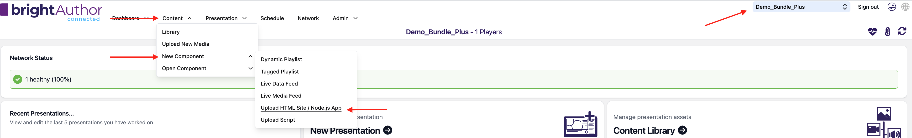
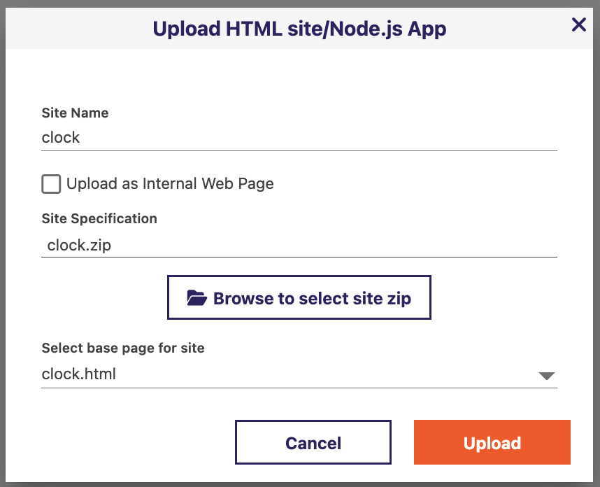
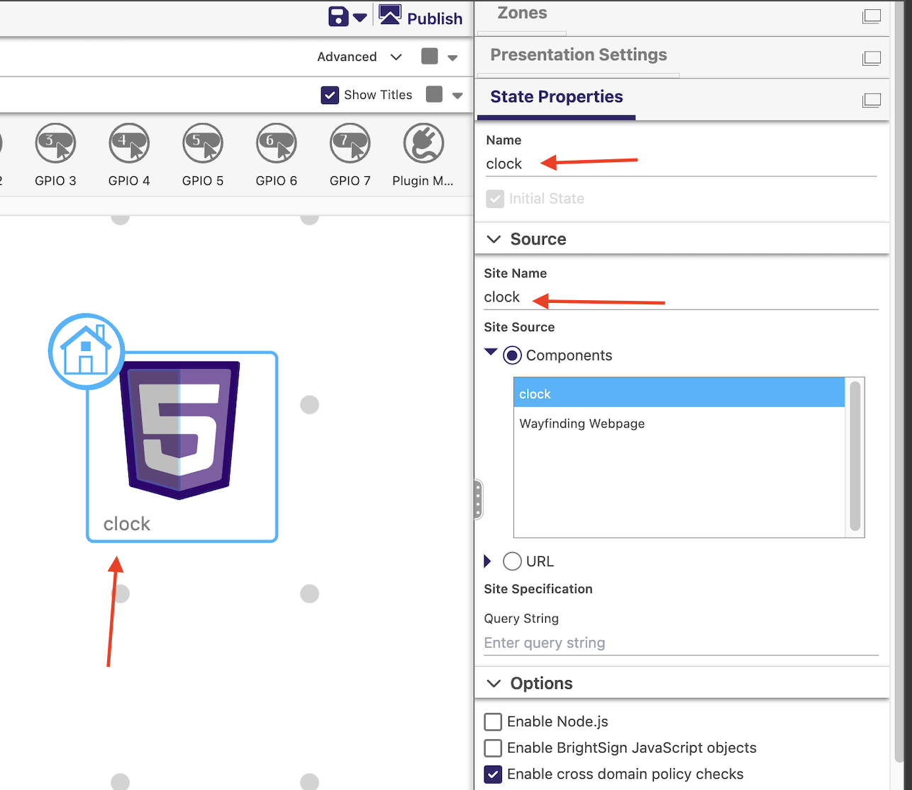

# Using the Clock Configurator

This tool builds a self-contained clock widget (`clock.html` plus any fonts
or background image you add) as a zip file you can deploy as an HTML5 zone
in a BrightSign presentation. You set everything up visually, watch a live
preview update as you go, and download the finished package when you're
happy with it.

## Opening the tool

This tool is hosted on GitHub Pages - open
**<https://romeolb.github.io/clock-date-html-app-builder/>** in a browser
and you're ready to go, no install or setup required.

If instead you're running it from a local copy of the repository, serve
the `clock-configurator` folder over `http://` or `https://` (a local
static server, or any web host) and open `index.html` that way. Double-
clicking the file to open it directly (`file://`) will work for editing and
previewing, but the **Generate & Download** step will fail - it needs to be
served over http(s) to fetch its own runtime file.

The page is laid out in two halves: your settings on the left, and a live
preview of the clock on the right. Every change you make updates the
preview immediately.

## Import existing config

If you've already generated a `clock.zip` (or just have the `clock.html`
file) and want to keep editing it, load it here. Everything below - layout,
colors, font, background - is restored from it, including any uploaded font
or background image if you load the `.zip` (loading a standalone `.html`
restores every setting except the actual font/image file, since only the
zip carries those bytes).

Want to try this out before building your own? [`docs/example-test-package/clock.zip`](example-test-package/clock.zip)
in this repository is a ready-made example that already has a custom font
and a custom background image set up - load it here to see a full
configuration restored, including both assets, then experiment with
changing it.

## Layout / Safe Text Region (%)

This section controls where the clock sits and how big the text is.

- **Preview zone width / height (px)** - has no effect on the exported
  clock, it only reshapes the preview panel. Set this to match the actual
  size of the zone you'll place the clock into in your presentation, so the
  preview's proportions - how close the text sits to the edges - match what
  you'll actually see on the player. Defaults to 1920x1080.
- **X / Y / Width / Height** - the rectangle (as a percentage of the zone)
  the clock text is allowed to use. `{x:0, y:0, width:100, height:100}` is
  the full screen; e.g. `{x:25, y:25, width:50, height:50}` confines the
  clock to the center quarter. The text is automatically sized to fill this
  box as much as possible without overflowing it.
- **Fit height to text** - a full-height box usually leaves blank space
  above and below a single line of text. Click this to shrink the box's
  height down to snugly fit the text, keeping it centered where it already
  is. You can still fine-tune the resulting numbers afterward.
- **Text scale (%)** - shrinks the automatically-computed text size further
  (10-100%). Use this if a particular font's glyphs run close to the edges
  of the box even after fitting.

## Mode & Time/Date

- **Mode** - Time or Date. The clock shows one or the other, never both.
- **Rotation** - rotates the whole clock 0/90/180/270 degrees, for a
  portrait-mounted display.
- **Language** - pick from the common languages in the dropdown, or choose
  **Custom...** to type any other BCP-47 locale code (e.g. `en-CA`). This
  drives month/weekday names and the default AM/PM-vs-24-hour convention.
- **12-hour format** (Time mode) - override the locale's default: force
  12-hour with AM/PM, force 24-hour, or leave it at "Locale default" (note
  that many locales, including UK English, default to 24-hour - this isn't
  a bug, pick "12-hour" explicitly if you want AM/PM regardless of locale).
- **Show seconds** (Time mode).
- **Show weekday** (Date mode).
- **Date order** (Date mode) - override the locale's natural date order
  with MDY / DMY / YMD, or leave at "Locale default".

## Colors

- **Text color** / **Background color** - any color.
- **Transparent background** - check this to make the background see-through
  instead of a solid color, useful if the clock is meant to overlay other
  content in your presentation rather than sit on its own background. This
  disables the background color picker while checked.

## Font

- **Font family** - the name used for the text. Leave this alone if you're
  not uploading a custom font file - it'll use the system default.
- **Custom font file** - upload a `.woff`, `.woff2`, `.ttf`, or `.otf` file.
  The Font family field auto-fills with a name based on the file so it
  applies correctly; you can retype it if you'd like a different name.
  **Clear font file** removes it and reverts to the default font.
- The **Browse & download Google Fonts as font files** link opens a tool for
  finding and downloading real font files to upload here.
- Not every font looks good once scaled up large or holds still as the
  clock ticks - see [`choosing-a-font.md`](choosing-a-font.md) in this
  folder for guidance on picking one that will.

If an uploaded font fails to load (a corrupted file, or one in an
unsupported format), an error banner appears explaining why - check that
banner if your custom font isn't showing up.

## Background

- **Stretch to fill (crop)** - when a background image is set, this makes
  it cover the whole zone (cropping as needed) instead of fitting within it
  without cropping.
- **Background image** - upload an image to sit behind the clock text.
  **Clear background image** removes it.

## Export

- **Output zip filename** - defaults to `clock.zip` if left blank.
- **Generate & Download** - bundles the generated `clock.html`, the shared
  runtime script, and any uploaded font/background image into that zip.
  Inside the zip, the widget is always named exactly `clock.html`, no
  matter what you named the zip itself - that's the filename BrightSign
  expects.

## Deploying to BrightSign

These steps use BrightAuthor:connected's web UI to add the downloaded zip
to a presentation as an HTML component.

1. Go to **Content → New Component → Upload HTML Site / Node.js App**.

   

2. In the **Upload HTML site/Node.js App** dialog that opens:
   - **Site Name** - give it a name, e.g. `clock`.
   - Leave **Upload as Internal Web Page** unchecked.
   - Click **Browse to select site zip** and choose the zip file you
     downloaded from the configurator.
   - **Select base page for site** - this should already read `clock.html`
     once the zip is selected (that's the filename the configurator's zip
     always uses for the widget itself, no matter what you named the zip).
   - Click **Upload**.

   

3. Add the uploaded component to a State in your presentation, sized and
   positioned to match the zone dimensions you set earlier in the
   configurator's Preview Zone Size fields.

   

**Make sure the state name, the Site Name from step 2, and the component
you select in step 3 all match** (e.g. all named `clock`). Mismatched
names between these three are a common reason the widget doesn't show up
as expected.

## Coming back to make changes later

Use **Import existing config** with the `.zip` you downloaded (or a
standalone `.html`, with the caveat above about fonts/images) to reload
everything and keep editing, then generate a new zip when you're done.
